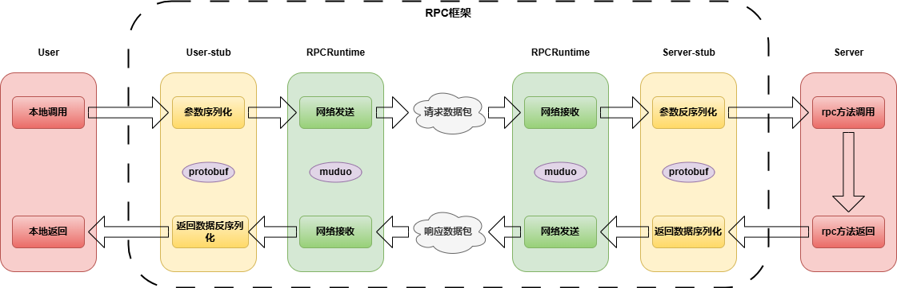
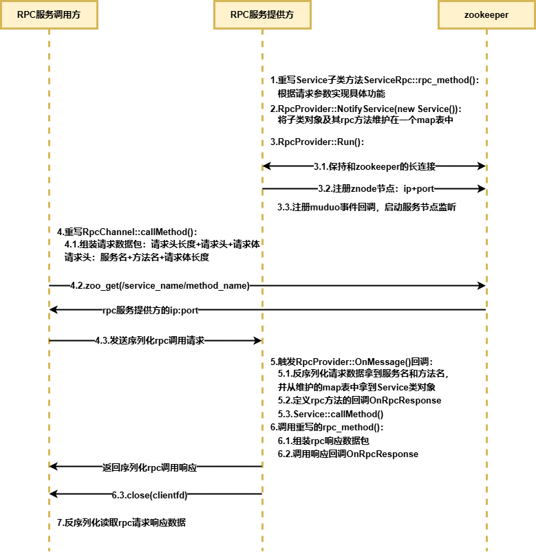
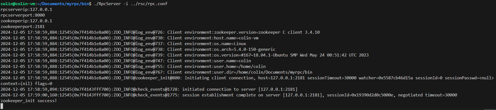
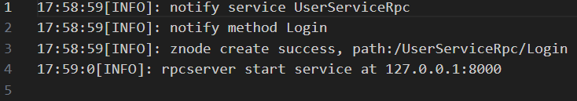
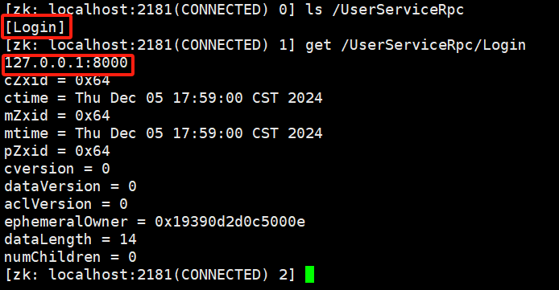
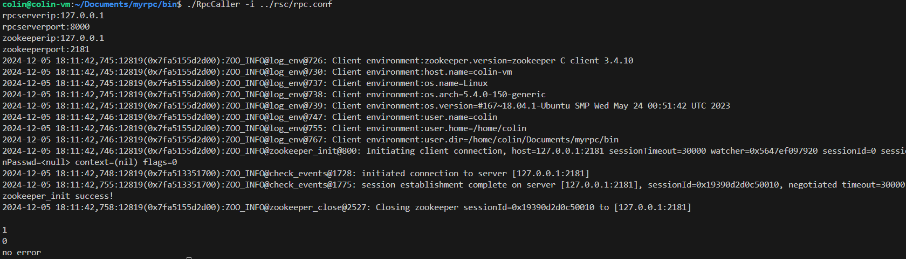
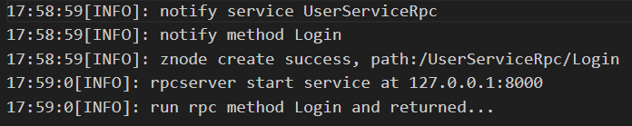

# myRPC

## 一、简介
本项目是一个基于C++的muduo网络库实现的轻量级RPC框架项目，用于分布式环境下不同服务节点之间的通信。项目中使用了protobuf作为数据交换的格式，并在此基础上自定义【**消息头大小+消息头+消息体**】的通信协议防止TCP粘包；另外选用中间件zookeeper作为服务的注册管理中心，实现服务发现；最后为了记录RPC服务的发布和调用情况，方便bug定位，项目还设计了线程安全的异步日志缓冲队列，实现日志消息的非阻塞写入。

## 二、框架总体设计

### RPC通信原理


### 框架代码交互


## 三、框架使用

### 依赖环境
* `ubuntu(version=18.04)`
* `cmake(version=2.6)`
* `g++(version=4.1)`
* `zookeeper(version=3.4.10)`
* `protobuf(version=3.20)`
* `muduo`

### 框架代码拉取和编译
```
git clone https://github.com/colinnsong/myrpc.git
cd myrpc  
mkdir build  
cd build  
cmake ..  
make  
```
框架的库文件libmyrpc.a生成在lib文件夹下

### 框架使用示例

#### protobuf数据格式定义
```
syntax = "proto3";

package fixbug;

option cc_generic_services = true;

message ResultCode{
    int32 errcode = 1;
    bytes errmsg = 2;
}
// 请求数据格式
message LoginRequest{
    string name = 1;
    string pwd = 2;
}
// 响应数据格式
message LoginResponse{
    ResultCode result = 1;
    bool success = 2;
}
// rpc方法的发布形式
service  UserServiceRpc{
    rpc Login(LoginRequest) returns(LoginResponse);
}
```

#### 修改配置文件rpc.conf
使用rpc框架发布rpc方法时，需要修改服务节点的ip和port以及zookeeper服务所在节点的ip
```
# rpc节点的ip和端口
rpcserverip=xxx.xxx.xxx.xxx
rpcserverport=xxxxx

# zookeeper的ip和端口
zookeeperip=xxx.xxx.xxx.xxx
zookeeperport=2181
```

使用rpc框架调用远程rpc方法时，只需要修改zookeeper服务所在的主机ip
```
# zookeeper的ip和端口
zookeeperip=xxx.xxx.xxx.xxx
zookeeperport=2181
```

#### 服务方发布RPC方法 [演示代码](./example/callee/userservice.cpp)
```
cd ../bin
./RpcServer -i ../rsc/rpc.conf
```




从运行终端打印、日志以及znode信息可以看出：rpc服务提供方已经通过框架发布了UserServiceRpc服务的Login方法，还连接到了zookeeper以及开始开始监听本机上的8000端口，准备接受远程的方法调用请求了

#### 调用方调用RPC方法 [演示代码](./example/caller/callservice.cpp)
```
cd ../bin
./RpcCaller -i ../rsc/rpc.conf
```



从运行终端打印、日志可以看出调用方已经通过框架连接到了zookeeper拿到服务节点的ip和port并调用了远程的rpc方法并正确返回